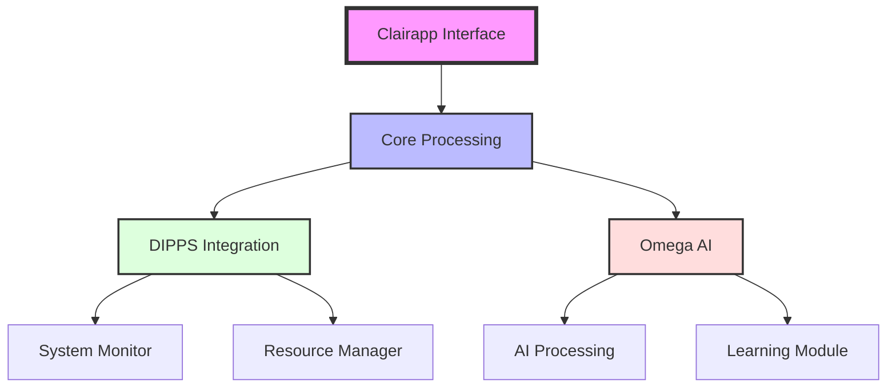
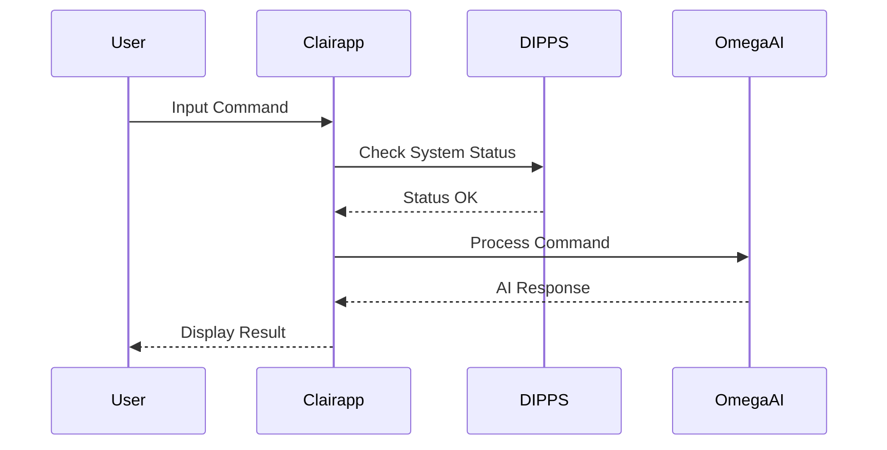
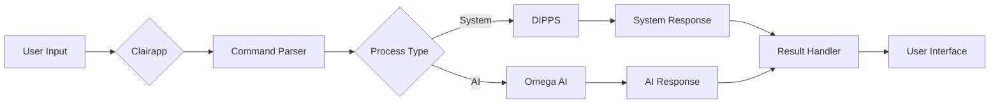
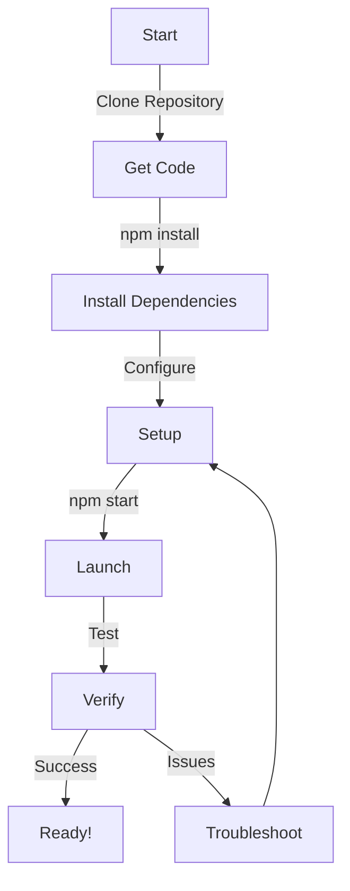
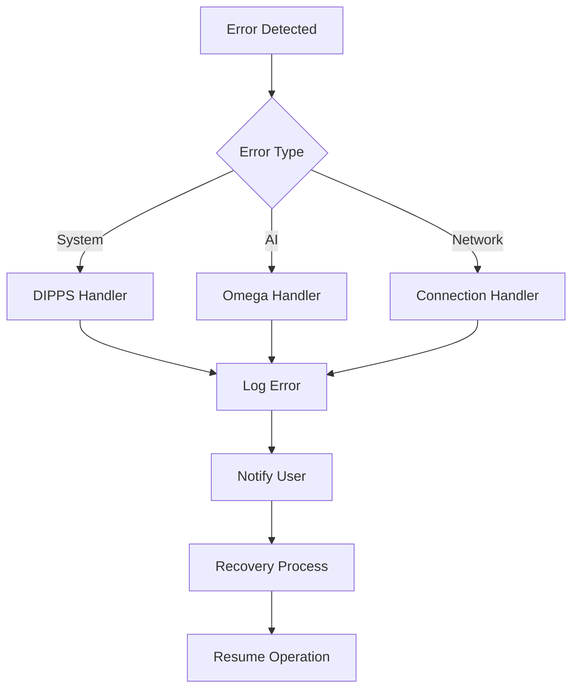

# Clairapp Architecture Guide 🏗️

## System Overview

## Component Interaction

## Data Flow

## Installation Process

## Key Features

1. **Real-time Processing**
   - Command interpretation
   - System monitoring
   - AI response generation

2. **Integration Points**
   - DIPPS system interface
   - Omega AI connection
   - User preference management

3. **Security Features**
   - Authentication
   - Secure communication
   - Data protection

## Performance Optimization

- Caching for frequent commands
- Load balancing between components
- Resource usage monitoring
- Automatic scaling capabilities

## Error Handling

## Best Practices

1. **Regular Updates**
   - Keep all components updated
   - Check for security patches
   - Monitor system health

2. **Backup Strategy**
   - Regular data backups
   - Configuration backups
   - System state snapshots

3. **Monitoring**
   - Performance metrics
   - Error logs
   - Usage statistics

---
*This documentation is maintained as part of the Clairapp project.*
